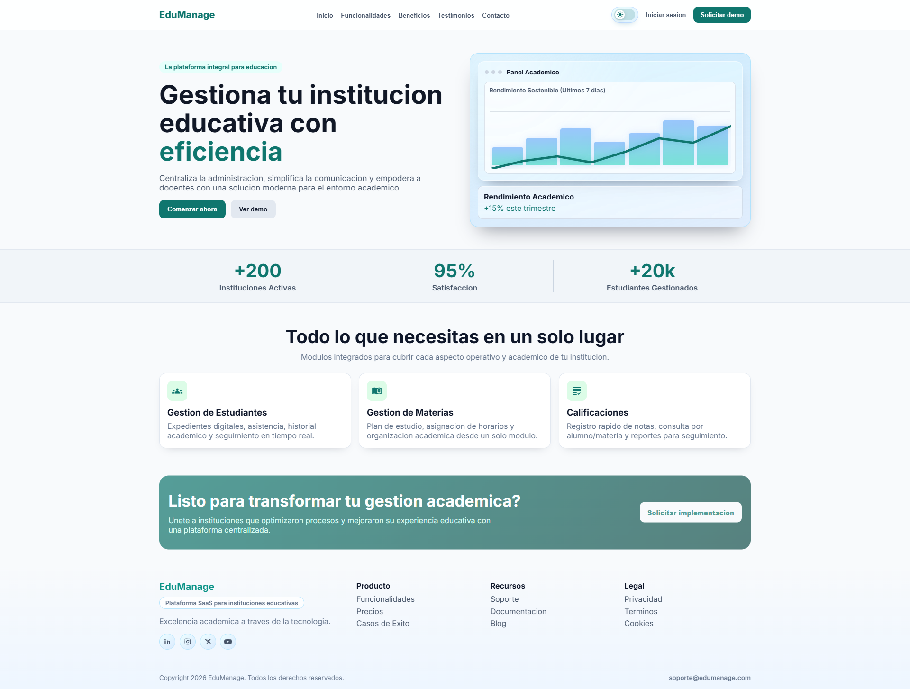
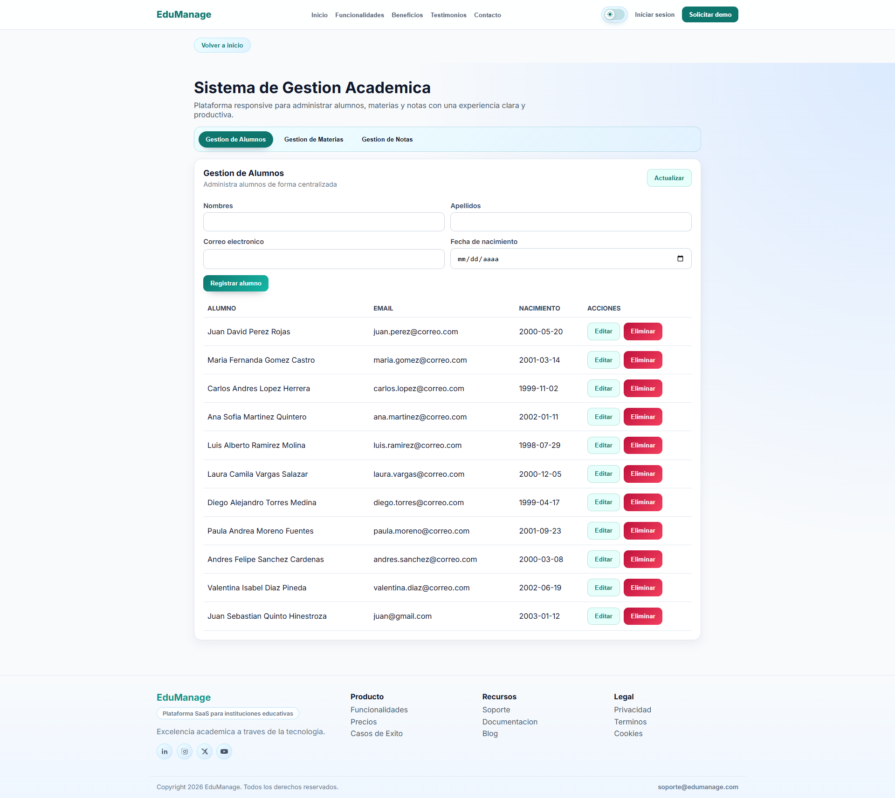
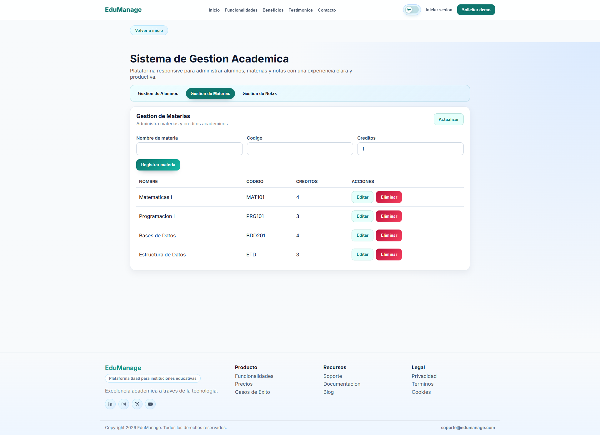
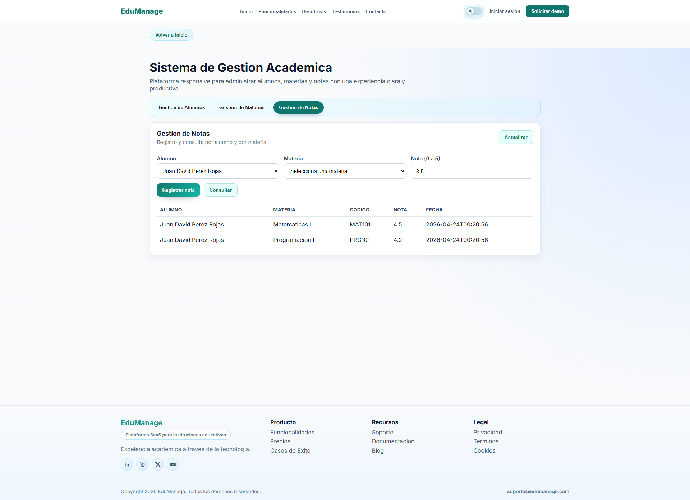

# Sistema Gestion Academica - Backend

API REST para gestionar alumnos, materias y notas usando Java 17, Spring Boot 3.5.14, MySQL y Docker.

## Tecnologias
- Java 17
- Spring Boot 3.5.14
- Spring Data JPA
- Maven
- MySQL 8 (Docker)
- Swagger/OpenAPI

## Variables de entorno (backend)
- `DB_URI`
- `DB_USER`
- `DB_PASSWORD`
- `DB_DRIVER`

En Docker Compose ya estan definidas para el servicio `backend`.

## Ejecucion
Ejecutar desde la raiz del proyecto:

1. `docker compose up -d --build`
2. `docker compose ps`
3. `docker compose logs -f backend`

## Accesos
- API base: `http://localhost:8080`
- Swagger UI: `http://localhost:8080/swagger-ui/index.html`
- OpenAPI JSON: `http://localhost:8080/v3/api-docs`

## Live demo (Render)
- Frontend live: [https://sistema-gestion-academica-frontend.onrender.com](https://sistema-gestion-academica-frontend.onrender.com)
- Backend API live: [https://sistema-gestion-academica.onrender.com](https://sistema-gestion-academica.onrender.com)
- Backend API live: [https://sistema-gestion-academica.onrender.com/swagger-ui/index.html](https://sistema-gestion-academica.onrender.com/swagger-ui/index.html)
- Nota: en la capa gratuita de Render, el primer acceso puede tardar mientras los servicios se activan nuevamente (cold start).

## Datos de prueba y backup
- Script de seed: `backend/db/seed/seed_data.sql`
- Backup requerido por la prueba: `backend/db/dump/academic_db.dump`

## Restaurar base de datos desde el .dump
Con contenedor MySQL levantado (`academic-mysql`):

4. `docker exec -i academic-mysql mysql -uroot -proot_pass_123 academic_db < backend/db/dump/academic_db.dump`

## Generar nuevamente el .dump
5. `docker exec academic-mysql sh -c "mysqldump -uacademic_user -pacademic_pass --databases academic_db --routines --triggers --single-transaction --no-tablespaces" > backend/db/dump/academic_db.dump`

## Probar endpoints principales
6. `POST /api/alumnos`
7. `POST /api/materias`
8. `POST /api/notas`
9. `GET /api/notas/alumno/{alumnoId}`

## Capturas de la web

### Landing

### Modulo academico

